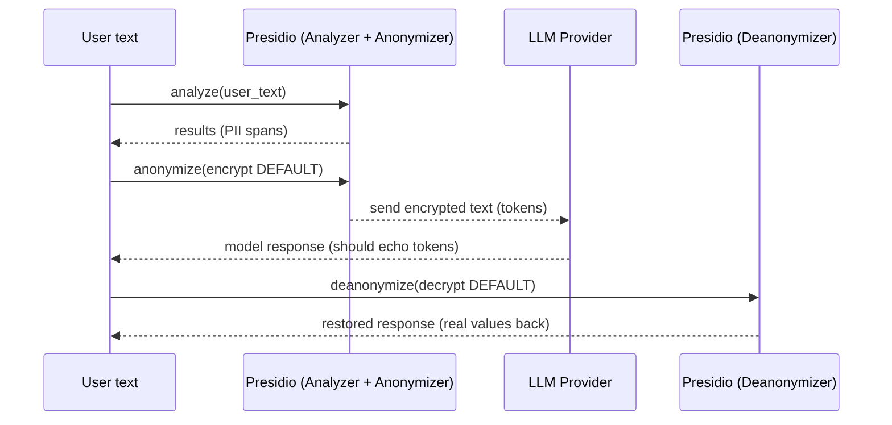

# PII Masking with Microsoft Presidio (and optional LLM privacy wrapper)

This project is a small, **hands-on learning repo** showing how to:

- **Detect PII** with *Presidio Analyzer*
- **Anonymize / mask / redact / encrypt** with *Presidio Anonymizer*
- (Optional) Wrap an LLM call so **PII never leaves your machine in plaintext**, then **restore** it after the LLM responds

---

## What is Presidio (in one minute)

Presidio is an open-source framework for **PII detection and anonymization**.

- **Analyzer**: finds sensitive spans (name, email, phone, etc.)
- **Anonymizer**: transforms those spans (mask, replace, redact, encrypt, …)
- **Deanonymizer**: reverses transformations that are reversible (e.g. decrypt)

---

## Visual overview (end-to-end)

### A) Standard Presidio pipeline (detect → anonymize)

```mermaid
flowchart LR
A[Raw text] --> B[Presidio Analyzer (analyze)];
B --> C[RecognizerResults (entity_type, start/end, score)];
C --> D[Presidio Anonymizer (anonymize)];
D --> E[Anonymized text];
```

### B) LLM-safe pipeline (detect → encrypt → LLM → decrypt)



Key idea: the LLM sees **only encrypted tokens**, not real PII. If the model keeps tokens intact, we can restore the original values.

---

## Repository tour

- `detection_anonymization.py`
  - Minimal “hello world”: analyze text and anonymize it.
- `custom_operator.py`
  - Shows **per-entity operators** (replace name, mask email, redact phone, default fallback).
- `custom_recognizer.py`
  - Adds a **custom pattern recognizer** (example: Aadhaar number format).
- `reversible_encryption.py`
  - Demonstrates **encrypt → decrypt** using Presidio operators.
- `llm_pipeline.py`
  - A **privacy wrapper** around an LLM call:
    - detect PII → encrypt spans → send to LLM → decrypt response

---

## Setup

### 1) Create and activate a virtual environment

Windows (PowerShell):

```bash
python -m venv .venv
.\.venv\Scripts\Activate.ps1
```

### 2) Install dependencies

```bash
pip install -r requirements.txt
```

### 3) Create a `.env` file (do **not** commit this)

Create `.env` with:

```text
OPENAI_API_KEY=your_key_here
OPENAI_MODEL=gpt-4o
PRESIDIO_ENCRYPT_KEY=16_chars_exactly
```

Notes:
- `PRESIDIO_ENCRYPT_KEY` **must be exactly 16 characters** (AES key length requirement used by Presidio’s encrypt/decrypt operators).

---

## Run the examples

### Detect + anonymize (built-in entities)

```bash
python detection_anonymization.py
```

### Custom operators (replace/mask/redact)

```bash
python custom_operator.py
```

### Custom recognizer (Aadhaar pattern)

```bash
python custom_recognizer.py
```

### Reversible encryption demo

```bash
python reversible_encryption.py
```

### LLM-safe pipeline

```bash
python llm_pipeline.py
```

---

## How to think about anonymization operators (quick cheat sheet)

- **replace**: swap detected span with a fixed value (e.g. `[NAME]`)
- **mask**: keep part of the value but hide the rest (e.g. `jo*****@example.com`)
- **redact**: remove the detected span entirely
- **encrypt**: reversible transform (requires a key; can be decrypted later)

---

## Safety and good practice

- Never commit `.env` or API keys. This repo includes a `.gitignore` to protect you.
- If you use the LLM-safe pipeline, **instruct the model to echo tokens verbatim** (see `llm_pipeline.py` system message). If the model paraphrases and drops tokens, decryption can’t reliably restore original values.

